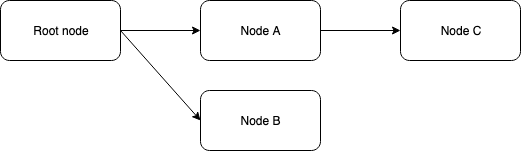

# AKAP:

## The LDAP of Ethereum

**Version: Final 20200118**

September 2019

**Authors**

Christian Felde, Mohamed Elshami

[https://akap.me](https://akap.me)

**Abstract**

This paper introduces the AKA protocol and AKAP registry smart contract, deployed on Ethereum networks. The primary benefit of AKAP is the ability to externalize and manage shared references and data, in addition to the discovery of these resources through hierarchical structure.

On the AKAP registry contract users may register nodes as part of a directed acyclic graph and then associate values and data on these nodes. Nodes are identified using a hashing technique combining their structural context and user selected identifiers.

The ownership of these nodes can be transferred and managed according to the ERC-721 Non-Fungible Tokens standard, enabling reuse of existing tools and procedures.

**Table of Contents**

1 Introduction

2 The AKA protocol

2.1 Creating and updating a node and its values

2.2 Node attributes

2.3 Transfer ownership of nodes

3 Implementation considerations

3.1 Identifying a node

3.2 Considerations and limits excluded from the label requirements

4 Reclaiming dead entries

5 Minimizing contract risk

6 Summary

# 1	Introduction

Only the simplest of software can function without interacting with other external components or holding shared global configuration values. We also see this within the realm of Ethereum smart contracts, with contracts, for example, holding an address reference to another contract.

This works fine in simple setups, but becomes difficult to manage when the number of references and locations of these references grow. It becomes time consuming, error prone, and difficult to manage.

The AKA protocol (AKAP) proposes a solution to this and other similar use cases by allowing anyone to register what we call a node. A node is simply an entry stored in the AKAP registry contract, following certain well-defined procedures, and is initially owned and control by whomever creates the node.

On a node, various types of attributes can be associated. This, for example, allows us to solve the above reference use case by now having these contracts look up the address rather than directly storing the address. Having this, we can now update this reference at a single location in the AKAP registry contract, rather than individually updating each and every direct reference.

Another use case could be for application specific configuration to be stored within the AKAP node. Assume for example that a certain dApp consists of a number of smart contracts. [1] For various reasons it might be beneficial for the administrator of this application to temporarily pause any interaction with these smart contracts. We can image each contract holding a flag value indicating this setting. Setting this flag to false causes any user interaction with the contract to stop from being allowed. If the administrator is required to update multiple flags across multiple contracts this causes maintenance issues from the complexity of interacting with multiple contracts. It also potentially causes transactional issues; What happens if some contracts have the flag set to false while other contracts still maintain the flag as true? Does it cause potential inconsistencies in contract state?

Instead of having separate flags across each of these dApp contracts we can imagine putting the configuration flag on a node in the AKAP registry contract. Each of the separate dApp contracts can then all reference this AKAP node when they need to check the flag value. This solves the complexity described by now only needing to update the flag in one location. And later, when new contracts are added whom also depend on this flag, these only need to reference the same existing node, rather than the value directly.

Thirdly, because nodes sit in a directed acyclic graph structure, we can foresee a use case where a contract is given a node reference from which it will navigate to other nodes using known relative relationships. From this we can build large and complex setups of any size, all of which can be atomically updated from a single node reference.

It is not hard to imagine additional use cases but we hope these are sufficient to illustrate the value of having such a centralized registry for managing such setups. We’ll also detail these with example source code.

While there are use cases and arguments we could imagine for why you’d want to deploy multiple instances of the registry, we think there are clear network benefits to having one shared AKAP registry. Just like the internet benefits from one shared IP address space or a global DNS, having one central registry allows anyone and everyone to build on a shared reference setup. The question then becomes: Why should anyone trust and build upon any such “centralized location,” as represented by the AKAP registry contract? We answer this question by arguing for no administrator functionality because it guides us towards guaranteed and consistent behaviour.

Firstly, for the registered nodes we mention above, these always have clear owners: Initially those that created a node become the owner. Ownership can later be transferred using the ERC-721 Non-Fungible Tokens standard. [2] Only current owners can modify a node.

More importantly however: There is no special user or owner of the AKAP registry contract itself. It is never possible for anyone with some kind of special access to override any aspect of the nodes, values on the nodes, or the hierarchical structure they sit within. There simply is not any such functionality in the AKAP registry contract. This can be verified by looking at the source code and byte code of the deployed contract.

This also implies that there is no functionality to “upgrade” the AKAP registry contract. The code that is deployed will forever remain. Naturally this does increase our risk for bugs which cannot be fixed, and we’ll discuss the approach to minimize such issues later in this paper.

The premissionless nature also guarantees that it will forever be free to use and interact with the AKAP registry contract beyond required transaction costs. [3] While a paid feature often motivates the removal of dead entries from a registry, we don’t have that luxury since it is free to use AKAP. As an alternative pruning mechanism, we’ll look at the reclaim functionality which allows dead entries to be taken out of service by anyone willing and capable to do so.

# 2	The AKA protocol

AKA, as you might have guessed, is an abbreviation for “also known as,” used when someone or something has another name. This is in essence what the AKA protocol, or AKAP, lets you do. By associating some identifier with another value of some kind you are creating a reference to this value. We call this reference a node, and a node consists of a parent node, a user defined identifier, in addition to various attributes. Each node can have an unlimited number of child nodes.

# 2.1	Creating and updating a node and its values

No node exists until it is first created. Creating a node involves calling a function on the AKAP registry contract. This process is known as claiming a node.

All nodes are created having another node as its parent. Child nodes can only be created by the owner of the parent node. The exception to this is the parentless root node, on which anyone can claim ownership of new child nodes. We illustrate such a structure next.

Here we find that Node A and Node B are children of the special root node. Someone claimed Node A and Node B on a first come first serve basis. They are now owners of these nodes unless they transfer ownership to someone else.

Node C was created by the then owner of Node A. While initially the owner of Node C was equal to that of Node A at the time Node C was created, the owner of newly created Node C can immediately transfer ownership to anyone else. The ownership of Node C does not change if the ownership of Node A is modified.

Only the owner of Node A could create Node C. As soon as ownership of Node C is transferred, it is no longer possible for the current or any future owner of Node A to influence any aspect of Node C. This does assume that Node C is kept alive as we will discuss later.

The structure you see above remains immutable at all times. It is never possible to change the parent of, say, Node C, or any other node for that matter. There is however an attribute on nodes called SeeAlso which can be used as pointers to other nodes. The SeeAlso attribute does not however change any structural relationship.

# 2.2	Node attributes

A few different attributes can be defined on each node. With the exception of the parent identifier and the self-identifier, the remaining attributes can be updated and set by the current owner of the node. Each attribute also contains metadata related to who set the value and when it was defined.

Nodes may hold the following attributes:

*   Parent node identifier: Contains the immutable parent node identifier.
*   Node identifier: An immutable node identifier on current node.
*   Node owner: The address of the current node owner.
*   SeeAlso: An optional identifier to another node.
*   SeeAddress: An optional Ethereum address value.
*   NodeBody: An optional application specific region of bytes.
*   TokenURI: An optional token URI.

As mentioned, both parent and node identifiers are set at node creation. These remain immutable from there on. We’ll focus on how these are defined later in the implementation section of this paper.

The remaining attributes, Node owner, SeeAlso, SeeAddress and NodeBody, may all be set by the owner of the node. Besides being defined as a blob of bytes, NodeBody does not otherwise dictate any specific structure. It is left to the application of NodeBody to define the meaning of these.

# 2.3	Transfer ownership of nodes

Each node, as described above, is to be regarded as a Non-Fungible Token. These tokens can be transferred to new owners as defined by the ERC-721 interface.

# 3	Implementation considerations

At its core the AKAP registry is a mapping between a derived identifier and related attributes. Public functions exposed on the registry smart contract allow for anyone to interact with the registry according to the protocol definition.

Much of the functionality relating to ownership and transfer rights are directly taken from ERC-721, with only some registry functionality needed on top.

Maybe the most distinctive functionality in the registry is the claiming process. This is the method used to create new nodes and for owners of existing nodes to maintain their ownership.

# 3.1	Identifying a node

We take inspiration from the namehash algorithm as found on EIP-137. [4] While not exactly the same it works on similar principles. Creating a node identifier follows these steps:

1. The process of claiming a node requires a caller to pass in the parent identifier, of type uint256, and a label sequence, of type bytes. The label sequence may contain any sequence of bytes assuming they have a length between 1 and 32 bytes.

2. The byte sequence is hashed using keccak256, and this produces a bytes32 output, which we call labelHash.

3. The hashed output of the byte sequence, labelHash, together with the parent identifier is again hashed using keccak256(abi.encode(parentId, labelHash)).

4. The output of step 3 is converted to uint256 and also used as the NFT id.

While the output from step 3 is of type bytes32, when converting this to uint256 on step 4 there is no loss of precision as a bytes32 will fit in uint256. We use uint256 as that is what identifies an ERC-721 token.

Interacting with a node, for example when setting or getting its attributes, will only require the uint256 identifier. Utility methods are provided on the registry contract to easily produce the identifier for your convenience.

# 3.2	Considerations and limits excluded from the label requirements

In the previous section we only specified that the sequence of bytes used as a node label needs only to conform to a length between 1 and 32 bytes. No other requirements are given.

This is different from what you can find in EIP-137, which also takes into consideration standardization requirements like UTS46. [5] It is understandable why you’d need such a standardization of domain names as they are intended to be human readable.

However, there is no direct requirement for node labels in AKAP to be human readable. It is left to the applications building on top of AKAP to put additional requirements as they see fit for their domain and subset of the node structure.

# 4	Reclaiming dead entries

While it is never possible to remove a node after it has been created, there is a potential issue with having “dead nodes” that no one can touch. It might be that the identifier holds value others could find useful but can no longer make use of because the node owner might have lost access to or interest in their own account.

If we had a mechanism of payments, a lack of future payments would automatically cause a node to expire. However, in the interest of maximising utility of the AKA protocol, no such payment is taken when claiming a node.

As a compromise, nodes will need to periodically be reclaimed in order for them to remain with the current owner. As long as nodes are reclaimed within 1 year, they are renewed for another year going forward. The owner is free to reclaim nodes as often as they want, with each reclaim causing the expiry date to be set 1 year into the future in relation to the invocation time of the reclaim. The function of reclaiming is equal to the function used to claim the node initially. A reclaim does not alter any other aspect of a node.

If a node has expired, i.e., the owner did not reclaim the node within a year, the node is again up for grabs by the parent node owner, just like we had initially when the node was first created. And if the parent happens to be the special root node, then anyone may claim such an expired node.

In the case of the parent node not being the special root node, this does allow for the flexibility to not reclaim child nodes, assuming the owner maintains the ownership of the parent. This is because an expired node remains fully functional, with its current values and attributes fully available.

# 5	Minimizing contract risk

Throughout this paper we have specified a minimal set of features for what can be stored on nodes in a directed acyclic graph. We have explicitly highlighted that we avoid complicated validation of node data, and rather leave this to the application. We reduce the scope to concern ourselves with simple structural integrity.

This has all been done on purpose because we think this is the simplest and safest method of eliminating potential bugs and issues. If functionality can be placed outside the registry contract we opt to do so.

Also, for the features required by ERC-721 we will opt to base this part of the implementation on existing source code, specifically that from OpenZeppelin, as we regard this as battle tested and well-reviewed code. [6]

This of course does not remove the need to perform reviews, testing and verifications of the concrete AKAP registry contract source code, which we invite everyone to participate in on our source code repository.

Allowing for more than sufficient time on this phase is important when we aim to not include any form of upgrade or administration features in the contract.

# 6	Summary

Throughout this paper we have presented the need for and functionality of the AKAP registry.

We argue that such a registry should be free to use in order to maximize utility. We also argue that there are network benefits with having one centralized registry, and we address the centralization risk by proposing that there should be no administrator feature on the contract.

We believe the AKA protocol is of genuine benefit to a lot of use cases and invite you to participate in the design, implementation and testing/verification process.

[1] [https://www.coindesk.com/information/what-is-a-decentralized-application-dapp](https://www.coindesk.com/information/what-is-a-decentralized-application-dapp)

[2] [http://erc721.org/](http://erc721.org/)

[3] [https://github.com/ethereum/wiki/wiki/White-Paper#messages-and-transactions](https://github.com/ethereum/wiki/wiki/White-Paper#messages-and-transactions)

[4] [https://eips.ethereum.org/EIPS/eip-137](https://eips.ethereum.org/EIPS/eip-137)

[5] [https://unicode.org/reports/tr46/](https://unicode.org/reports/tr46/)

[6] [https://github.com/OpenZeppelin/openzeppelin-contracts/tree/master/contracts/token/ERC721](https://github.com/OpenZeppelin/openzeppelin-contracts/tree/master/contracts/token/ERC721)
